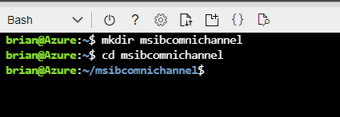
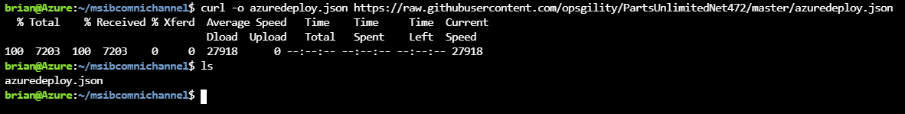
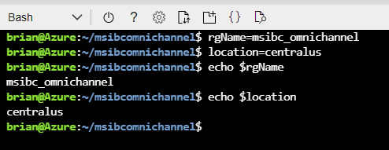
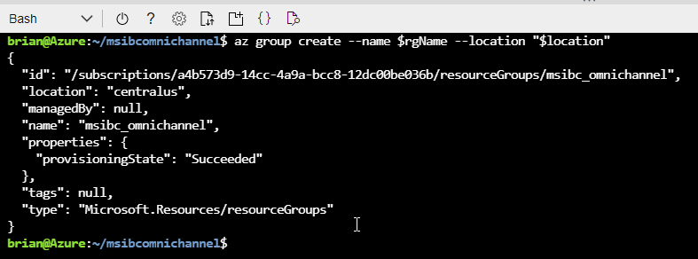
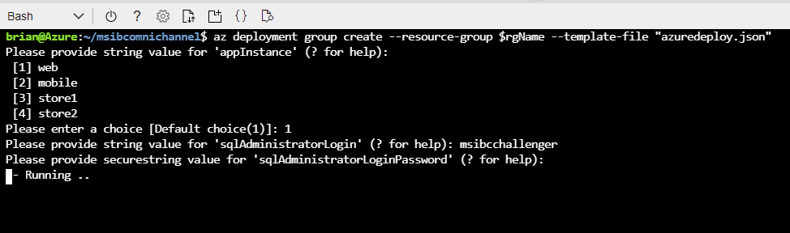
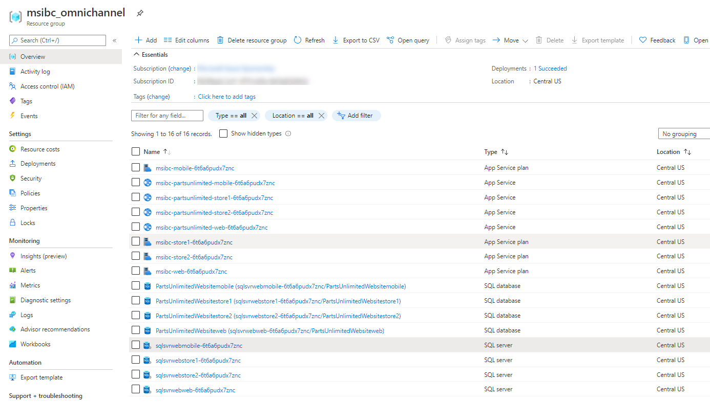
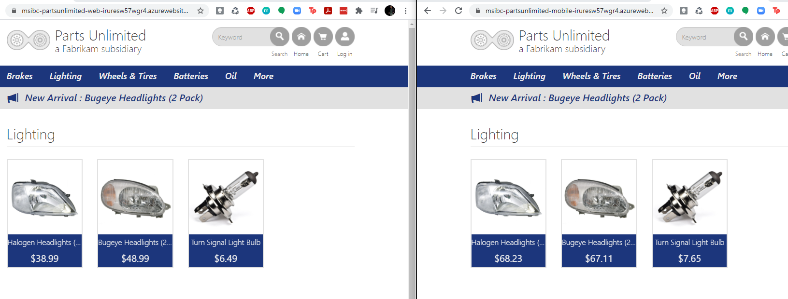
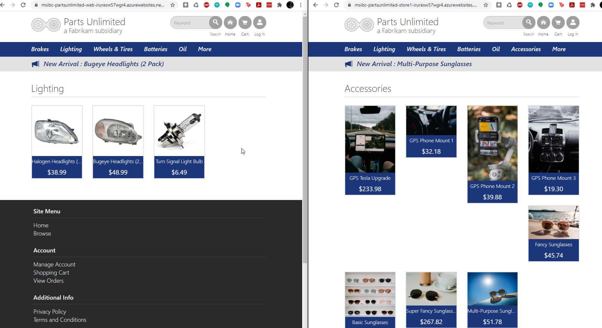
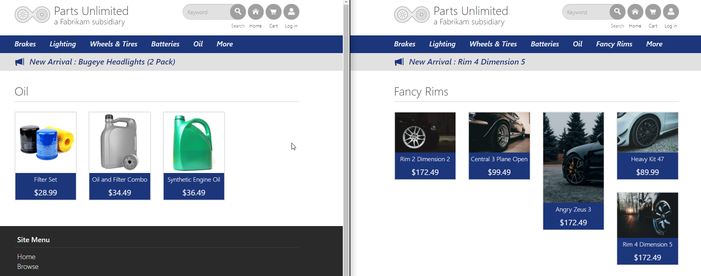

<div class="MCWHeader1">
Microsoft Industry Based Challenges - Omnipresent 
</div>

<div class="MCWHeader2">
Before the challenge lab setup guide
</div>

<div class="MCWHeader3">
March 2021
</div>

Information in this document, including URL and other Internet Web site references, is subject to change without notice. Unless otherwise noted, the example companies, organizations, products, domain names, e-mail addresses, logos, people, places, and events depicted herein are fictitious, and no association with any real company, organization, product, domain name, e-mail address, logo, person, place or event is intended or should be inferred. Complying with all applicable copyright laws is the responsibility of the user. Without limiting the rights under copyright, no part of this document may be reproduced, stored in or introduced into a retrieval system, or transmitted in any form or by any means (electronic, mechanical, photocopying, recording, or otherwise), or for any purpose, without the express written permission of Microsoft Corporation.

Microsoft may have patents, patent applications, trademarks, copyrights, or other intellectual property rights covering subject matter in this document. Except as expressly provided in any written license agreement from Microsoft, the furnishing of this document does not give you any license to these patents, trademarks, copyrights, or other intellectual property.

The names of manufacturers, products, or URLs are provided for informational purposes only and Microsoft makes no representations and warranties, either expressed, implied, or statutory, regarding these manufacturers or the use of the products with any Microsoft technologies. The inclusion of a manufacturer or product does not imply endorsement of Microsoft of the manufacturer or product. Links may be provided to third party sites. Such sites are not under the control of Microsoft and Microsoft is not responsible for the contents of any linked site or any link contained in a linked site, or any changes or updates to such sites. Microsoft is not responsible for webcasting or any other form of transmission received from any linked site. Microsoft is providing these links to you only as a convenience, and the inclusion of any link does not imply endorsement of Microsoft of the site or the products contained therein.

© 2021 Microsoft Corporation. All rights reserved.

Microsoft and the trademarks listed at <https://www.microsoft.com/en-us/legal/intellectualproperty/Trademarks/Usage/General.aspx> are trademarks of the Microsoft group of companies. All other trademarks are property of their respective owners.

**Contents**

<!-- TOC -->

- [Omni-channel Optimization before the challenge setup guide](#omni-channel-optimization-before-the-challenge-setup-guide)
  - [Requirements](#requirements)
  - [Before the challenge](#before-the-challenge)
    - [Prerequisites](#prerequisites)
    - [Task 1: Use Azure Shell](#task-1-use-azure-shell)
    - [Task 2: Get the Deployment Template](#task-2-get-the-deployment-template)
    - [Task 3: Deploy the Environments](#task-3-deploy-the-environments)
    - [Task 4: Validate Environments and Data](#task-4-validate-environments-and-data)

<!-- /TOC -->

# Omni-channel Optimization before the challenge setup guide

## Requirements

1.  Microsoft Azure subscription (MSDN or Pay As You Go)

## Before the challenge

Duration: 10 minutes

In this guide, you will provision the mock environment and data for the Microsoft Industry Based Challenge "Omni Channel Optimization"

### Prerequisites

-   Microsoft Azure subscription -- MSDN or Pay-as-you-Go

### Task 1: Use Azure Shell

>**Note**: This guide can be completed using only the Azure Cloud Shell.

1.  In a web browser, navigate to https://shell.azure.com. Alternatively, from the Azure web portal, launch the **Azure Cloud Shell**. It has common Azure tools preinstalled and configured to use with your account.

    


### Task 2: Get the Deployment Template

1.  Create a new folder:

    ```bash  
    mkdir msibcomnichannel
    cd msibcomnichannel
    ```  

    

1.  Using the Azure Cloud Shell, you can download the file by executing the following command inside the Cloud Shell window (all on one line):

    ```bash
    curl -o azuredeploy.json https://raw.githubusercontent.com/opsgility/PartsUnlimitedNet472/master/azuredeploy.json
    ```  

    Then run 

    ```bash  
    ls
    ```  
    
    Ensure that you see a file `azuredeploy.json`.

    

3.  When completed, you will have a new ARM template to deploy the app service plan, the app service, a SQL server and a database to four environments to simulate the following:  

    *   Web [The company's public-facing website]
    *   Mobile [The version of the web that mobile users see]
    *   Store1 [Simulating a physical store location]
    *   Store2 [Simulating another physical store location]
   
4.  If you wish, you can review the ARM template.  

    What you will find is that with the template you will deploy the following resources per environment

    *   An App Service Plan for .Net in the F1 [Free] tier
    *   An App Service that is built and deployed based on code in a GitHub repository.  You will not modify this code for the challenge.  
    *   An Azure SQL Server 
    *   An Azure SQL Database in the Basic plan [$5/month]

    You will deploy four versions of the environment, so you will have four instances of SQL Server that will be accumulating cost.  The remaining resources should incur no charges.

### Task 3: Deploy the Environments

1. Within CloudShell, toggle from PowerShell to Bash using the selection on the top right of the terminal screen.
   
2. Navigate the prompt to the msibcomnichannel folder if you are not already there.

    ```bash  
    cd msibcomnichannel
    ```  
   
3. Using the Azure CLI, create a new resource group  

    Name the resource group appropriately (such as msibc_omnichannel).  Set the location to the region nearest to you. 

    ```bash  
    rgName=msibc_omnichannel
    location=centralus
    echo $rgName
    echo $location
    ```  

    
    
    Once the group name and location are set to variables, create the group:  

    ```bash
    az group create --name $rgName --location "$location"  
    ```  

    

4. Deploy the template.

    Now that the resource group is completed, deploy the template with the following command:

    ```bash
    az deployment group create --resource-group $rgName --template-file "azuredeploy.json"  
    ```  

    For the first run, select `Web`.   

    You will be prompted to enter credentials for the SQL Server.  

    ```bash  
    msibcchallenger
    ```  

    ```bash
    msibc@chllngr123
    ```  

    

5.  Repeat for the three remaining environments.  

    Repeat to deploy all four environments.  

    Once completed, the following resources should appear within your Resource Group within the Azure Portal.
    
    
    
### Task 4: Validate Environments and data

1. Validate deployments

    Make sure that you can load all four webpages.  You should be able to find the urls for your four app services in the azure portal.

    ]

2. Skew prices and counts on Mobile site

    When you are on the `Mobile` site, make an additional navigation to the url:  

    ```  
    https://<your-site>.azurewebsites.net/ChallengeSeeds/SeedMobile
    ```  
    
    For example, your link should look similar to this:  `https://msibc-partsunlimited-mobile-iruresw57wgr4.azurewebsites.net/ChallengeSeeds/SeedMobile`

    You will not see anything new, but the prices and inventory counts will be skewed for this instance when compared to the original site.

    

3. Skew prices and counts and Add a Category with products on Store1

    When you are on the `Store1` site, make an additional navigation to the url:  

    ```  
    https://<your-site>.azurewebsites.net/ChallengeSeeds/SeedStore1
    ```  

    You will see a new category `Accessories` with some products.  Additionally the prices and inventory counts will be skewed for this instance when compared to the original site.  

    

4. Skew prices and counts and Add a Category with products for Store2

    When you are on the `Store2` site, make an additional navigation to the url:  

    ```  
    https://<your-site>.azurewebsites.net/ChallengeSeeds/SeedStore2
    ```  

    You will see a new category `Fancy Rims` with some products.  Additionally the prices and inventory counts will be skewed for this instance when compared to the original site.  

    

5. Confirm/Ensure Environment Details

    With the four environments, a couple of quick notes.  

    * The Web version is considered the source of truth, every other version diverges from this default implementation.  

    * The mobile version will not have product or category discrepancies, but will have price and inventory inaccuracies.  These are randomly generated, so the values may be quite a bit different than the web version.  

    * The Store1 version will have an extra category for `Accessories` that will have some additional products.  Store1 will also contain price and inventory inaccuracies/disparities.  

    * The Store2 version will have an extra category for `Fancy Rims` that will contain additional products.  Store2 will also contain price and inventory inaccuracies/disparities.  

    >**Note:** If you run the skew prices (Seed) routine more than once for an environment you will continually increase the prices of products to ultimately reach a maximum of $500.00 on all products.  You should not do this - you should only run each seed method one time.  Products and Categories will not be duplicated no matter how many times you run the seeds.

2. Final Thoughts

    With the four environments deployed, you have set up the simulation so that you can work with the data from the web, mobile, and two stores that all have their own backing database to combine the data and provide the solutions as needed by the company for the omni-channel solution.

You should follow all steps provided *before* starting the Omni-channel optimization industry-based challenge.
