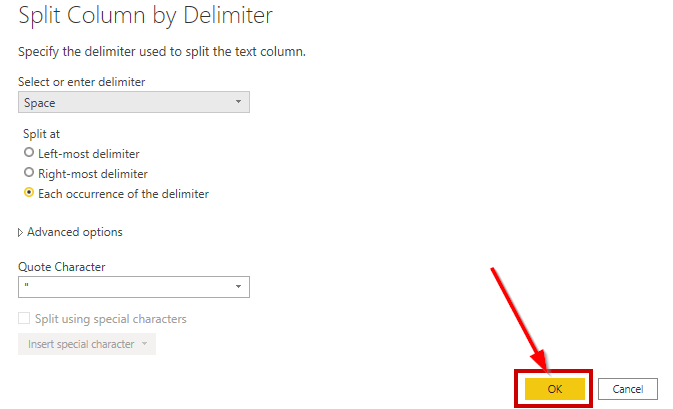
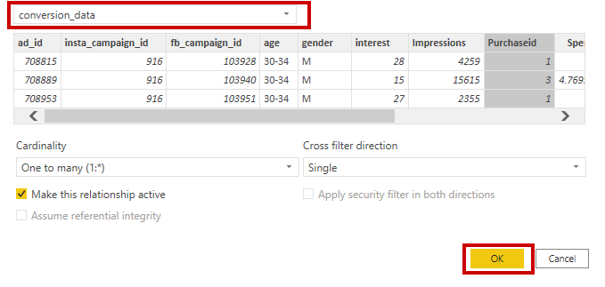
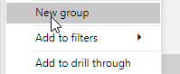
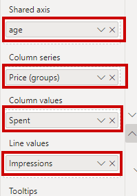
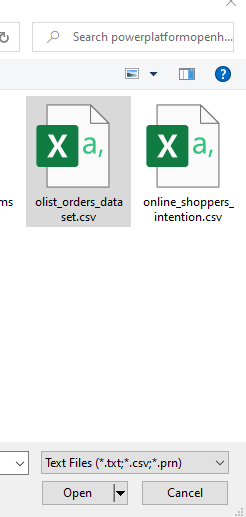

<!-- 

-->

# Industry-Based Challenges: Supply Chain Optimization  

## Challenge lab coach guide  

### March 2021  

Information in this document, including URL and other Internet Web site references, is subject to change without notice. Unless otherwise noted, the example companies, organizations, products, domain names, e-mail addresses, logos, people, places, and events depicted herein are fictitious, and no association with any real company, organization, product, domain name, e-mail address, logo, person, place or event is intended or should be inferred. Complying with all applicable copyright laws is the responsibility of the user. Without limiting the rights under copyright, no part of this document may be reproduced, stored in or introduced into a retrieval system, or transmitted in any form or by any means (electronic, mechanical, photocopying, recording, or otherwise), or for any purpose, without the express written permission of Microsoft Corporation.

Microsoft may have patents, patent applications, trademarks, copyrights, or other intellectual property rights covering subject matter in this document. Except as expressly provided in any written license agreement from Microsoft, the furnishing of this document does not give you any license to these patents, trademarks, copyrights, or other intellectual property.

The names of manufacturers, products, or URLs are provided for informational purposes only and Microsoft makes no representations and warranties, either expressed, implied, or statutory, regarding these manufacturers or the use of the products with any Microsoft technologies. The inclusion of a manufacturer or product does not imply endorsement of Microsoft of the manufacturer or product. Links may be provided to third party sites. Such sites are not under the control of Microsoft and Microsoft is not responsible for the contents of any linked site or any link contained in a linked site, or any changes or updates to such sites. Microsoft is not responsible for webcasting or any other form of transmission received from any linked site. Microsoft is providing these links to you only as a convenience, and the inclusion of any link does not imply endorsement of Microsoft of the site or the products contained therein.

© 2020 Microsoft Corporation. All rights reserved.

Microsoft and the trademarks listed at <https://www.microsoft.com/legal/intellectualproperty/Trademarks/Usage/General.aspx> are trademarks of the Microsoft group of companies. All other trademarks are property of their respective owners.


# Supply Chain Optimization challenge lab coach guide

## Abstract and learning objectives

Parts Unlimited, a subsidiary of Fabrikam Retail INC., has been feeling some pain and would like your help to redesign and implement some new solutions to be able to better compete in the current marketplace.  Among the main problems that Parts Unlimited is facing are 

*   Lack of connection between online and in-store data leading to an inability to provide a selection optimization that is tailored to a specific customer
*   Lack of infrastructure to maximize cost savings through correct inventory levels
*   Poor last-mile delivery
*   Departments operate in silos so they cannot communicate due to disparate data sources.
*   Limited visibility of data with no feedback loop on the supply chain.
*   Affecting changes to the supply chain is not a trivial endeavor. 
*   No current 360 degree view of the supply chain. 

To remedy this situation, Parts Unlimited is asking you to build a system that takes all of the supply-chain data and ingests it into IoT and Event Hubs as necessary, then performs analysis on the data.

Key success criteria will include 

*   Contract Cycle data and optimization
*   Available to promise capabilities
*   Price-elasticity analysis
*   Route planning and scheduling
*   Demand forecasting

Included in the analysis and processing will be data from 
*   Point of sale transactions
*   Purchase data from all channels
*   Device/Sensor data from IoT devices
*   Warehouse logistical and operational data
*   Social media sentiment and analysis

The primary goal for this system is to conglomerate all of the data into a single source of truth for use in reporting, bringing together all of the moving pieces from the supply chain.  

In the end, your solution should provide a vision that allows the audience (the Chief Marketing Officer, Chief Digital Officer, the Chief Data Officer, and the Customer Experience Manager) to understand how using this solution will give the information that is needed to deliver a 360 degree view of the supply chain.

## Customer case study

### Customer situation

Parts Unlimited Retail, Inc has been selling goods through various retail channels for the past 15 years.  As various platforms and technologies have evolved, Parts Unlimited has struggled to keep up, but has done the best they could to continue to provide solutions for their customers.  

Currently, they have just over 200 brick-and-mortar stores but are planning to close 50+ of these stores next year, taking the number of physical locations down to 150 stores due to declining revenue and various other factors.  Of the remaining 150 stores, 35 of them are currently streamlined for an attempted re-branding that happened a few years ago.  The re-branded stores were chosen based on population bases of less than 50,000 in an 200 square mile radius or within 50 miles of a major metropolitan area. These rebranded "Parts Unlimited Hometown" stores eliminated most of the non-essential retail, such as sporting and workout equipment, and focused in on essentials like appliances, automotive, and kept a limited selection of electronics, only offering about 15% of the options for items like UHD televisions, antennas, and blu-ray players.  Customers have expressed frustrations when an advertisement in the local newspaper for Parts Unlimited included a great deal on a large-screen television only to find they have to order online or drive to the larger store in a city that is sometimes located over 50 miles away.  While it is clear that customers are not pleased with this solution, it is not clear if this is an effective strategy to save the company when it comes to providing a simplified retail option. 

In addition to re-branding efforts, in the past few years attempts have been made to enhance the web app for responsive delivery and a couple of apps were also built to specifically target IOS and Android devices. Unfortunately, the data from these applications and the web solution is not connected, and when a user switches devices or goes from a device to the web, the experience is not uniform, leading to confusion and frustration.  Questions such as "why isn't the item I selected on my phone in my cart when I go to the website?" are far too common.    

Parts Unlimited needs an ability to collect and analyze all of this data in order to make the best uniform solution possible.   The final solution from this challenge workshop should provide an ability for Parts Unlimited to take control of their supply chain so that customers can know when and where products are going to be available, and that stores can be prepared to keep up with expected demands.  

While there are clearly other issues at play that Parts Unlimited needs to solve, the solution you are creating in this workshop needs to allow for a user to be able to walk into a brick-and-mortar store and get the items they are looking for, and for the stores to have the ability to meet demand based on an optimized supply chain. 

This goal of improved ability to meet customer demand will be accomplished by establishing a 360 degree view of the supply chain, with data analysis and reporting that provides the business the ability to plan and schedule deliveries of products according to forecasted needs, based on customer sentiment current buying trends.

#### Customer's current process

Parts Unlimited currently has over 200 brick-and-mortar stores, with 50+ stores closing and 35 stores running the re-branded profile.  Some stores have a pre-determined, limited selection and a limited inventory of the products they do offer. 

Parts Unlimited has an MVC website written in the .Net Framework and has been previously upgraded to version 4.72. The website is supposed to be responsive, as it utilized Bootstrap for responsive layout, but the site is currently not able to work on a few devices due to some styling problems.  

In addition to the website, Parts Unlimited has an Android application written in native Java that is three versions behind the current version of Android, but has been upgraded enough to continue to work on newer devices, even though it does not necessarily leverage all of the features of newer devices.  

Along with the website and android app, a third app written in Swift is available for use on the Apple IOS devices.  

All applications and sites do work, but the user experience, including sign-on, shopping cart, and other factors is unique to each platform.  For example, a user must sign in on the website and then sign in again on the device, and the shopping cart is not shared across devices, so items added to the cart on the web do not show up on the phone, or vice-versa.

As a struggling retailer, Parts Unlimited has a limited amount of resources to apply to getting the entire experience upgraded, so they need you to come up with the best, cost-effective solution.   

When it comes to supply chain management, Parts Unlimited is not very efficient.  They currently have five different departments, all siloed, and none of the departments are working together to get to the overall vision that Parts Unlimited needs.  This is in addition to separate databases used to track products, orders, and customers for the online and the physical store inventory and ordering systems.

The current reporting systems live on top of four different systems with five total silos.  They are as follows:

*   SAP for Demand Planning
*   SAP for Financials
*   Salesforce CRM
*   JD Edwards EDI
*   Oracle Retail ERP

### Current Process  

Current Customer buying solutions:  

 

Current supply chain reporting:  
 

### Customer needs

1.  Use Azure data and analytics tools to create a 360 degree view of the supply chain.

2.  Ingest data from existing systems as defined, as well as other systems and future implementations (i.e. IoT Devices, Website and app telemetry for customer search and purchase data).  Data from point of sale transactions and purchase information should also be ingested.  

3.  Provide reporting to the business user to be able to make decisions around the contract cycle, delivery scheduling and route planning, and demand forecasting with price-elasticity metrics.

4.  Optimize warehouse inventory management and staff utilization to ensure all channels are working with efficiency and no under-staffing or over-staffing according to predicted demands.

5.  An optimized last-mile delivery plan to ensure that customers are getting their orders as quickly as possible.  

6.  An ability to use feedback in any step of the process, as well as give feedback based on findings.  

7.  Because the solution has optimized the supply chain, it will also be possible to optimize the customer return process to expedite returns and getting the products back on the shelves to be sold to other customers.  

### Infographic for common scenarios
 
 

_High-level architecture_

1. Without getting into the details (the following sections will address the particular details), diagram your initial vision for handling the top-level requirements for 

*   Identification of data sources
*   Ingestion of streaming data from sources
*   Organization and/or filtering of data
*   Creating the expected reports
*   Presentation of data to the business users

## Challenge 1: Build the architecture for collecting and ingesting (extract) data

_Data ingest_

1. What are your recommended options for ingesting payment transaction events and customer browsing and shopping data as they occur in a scalable way that can be easily processed?

2. Of the ingest options you identified previously, which would you recommend for Parts Unlimited's scenario?

_Data ingest solution_

To get all the data, you will need to be able to ingest data from the various sources that exist as well as potentially respond to devices and other channels, so you'll have Azure Data Factory, an IoT Hub, and potentially an EventHub.  You will then likely use other tools to transform the data and filter the results for presentation.

## Create an Azure Data Lake Storage account and Azure Synapse Analytics service

Before you can connect datasources, you will need to create an Azure Data Lake storage account and the Azure Synapse Analytics service.

### Task 1: Create an Azure Data Lake Storage account

1. Open a web browser and navigate to the Azure portal.

   ```bash  
    https://portal.azure.com
   ``` 

2.  Navigate to the Resource group again and Select **+Add** to create a new resource
   
3.  Search and Select **Storage account** to create a storage account

4.  Complete the following information:
       - Subscription: Your Azure subscription
       - Resource group: use existing
       - Region: same as application created in Before HOL (Central US)
       - Name: Create a unique name
       - Performance: Standard
       - Account kind: StorageV2 (general purpose v2)
       - Replication: Locally-redundant storage (LRS)
  
      

5.  Select **Next** twice to get to the **Advanced** tab
6.  On the **Advanced** tab, locate **Data Lake Storage Gen2**, and select **Enabled** for Hierarchical namespace
   
      

6.  Select **Review + create**
7.  Select **Create** to create the storage account

### Task 2: Create an Azure Synapse Analytics service

1.  Search **Azure Synapse Analytics** and select **Create Synapse workspace**

      

2. On the **Create Synapse workspace** blade, complete the following information.
- Subscription: select existing subscription
- Resource group: Same as created in **Before the Challenge**
- Managed resource group: Leave blank and it will be created
- Workspace name: Enter a unique name
- Region: Select the same region from **Before the Challenge**
- Data Lake Storage account: Select the account created in step 3
- File system name: Select **Create new** and enter a name

   

3.  Select **Next: Security**
    
      
      

4.  Replace the **Admin username** with the username **msibcchallenger**. This is the same username provided for the Azure SQL Databases created in the **Before the Challenge** configuration
5.  Use the same password used in the **Before the Challenge** for the SQL Databases
6.  Select **Review + create**
    
          

7.  When validation succeeds, Select **Create**
8.  When deployment is complete, select **Go to resource**
9.  Under **Analytics pools**, select **SQL pools**

          

10. Select **+New**
    
      
          
11. Enter a name for the **Dedicated SQL pool name** and change the **Performance level** to **DW100c**
12. Select **Review + create**

      
      

### Task 3: Create Azure Data Factory

1. Navigate to the Resource group created in the Before HOL setup instructions.
   
2. Select **+Add** to create a new resource

   

3. Search for **Data Factory** and select **Create**

   

4. Complete the following information:
   - Subscription: Your Azure subscription
   - Resource group: use existing
   - Region: same as application created in Before HOL (Central US)
   - Name: Create a unique name

   

5. On the Git configuration tab, select the box for **Configure Git later**

6. Select **Review + create** and then **Create** to create the Data Factory

7. Select **Go to resource** when the Data Factory deployment is complete

   

   >**Note**: In order to meet Parts Plus' requirements for presenting data, we will need to analyze the data from the various store websites.  Data Factory will be used to move this data from the SQL databases to an Azure Storage Account that can then be accessed by Azure Databricks or Azure Synapse Analytics.

8.  Navigate back to the Resource group and select the **Data factory** service that you created.
   
9.  Select **Author & Monitor** on the overview blade

      

## Challenge 2: Build the architecture for loading and transforming data

_Data transformation_

1. Will data transformation be needed?

2. If so, Which option would you recommend and why?  

3. Will there need to be a hot and a cold path on this data? 

_Data processing_

1. How will you filter the data to get relevant information?

2. How will you ensure that data processes are repeatable?

_Data processing solution_

Data ingested will be moved from Azure Data Factory to Azure Data Lake storage, where it will be fed into Azure Synapse Analytics Spark tools to analyze and transform the data for presentation.  Information from IoT devices and event hub will be moved by Azure Stream Analytics into CosmosDB for analysis in Azure Synapse Analytics services.

## Develop a data factory pipeline for data movement

### Task 1: Connect data sources to copy data

1. This takes you to the Azure Data Factory portal
   
2.  Under **Let's get started**, select the **Copy data** image

      

3.  In the Properties page, specify **CopyFromSQLToSynapse** for the Task name field, and select Next. 
4.  In the task description, enter **Moving data from store website SQL databases to Azure Synapse Analytics for analysis**
5.  Select **Next**

      

6.  In Source data store, select **+ Create new connection**

      

7.  When the New linked service blade opens, select the **Azure** tab and select **Azure SQL Database**

      

8.  Select one of the SQL databases that was created in the initial Before the Challenge setup.  Use SQL authentication with the login credentials created in the Before the Challenge setup.  Your **New linked service** configuration should look similar to the screenshot below.

      

9.  Select **Create**
    
10. Repeat steps 24-26 until all store databases are connected

      


11. After all databases are connected, select **Next**


12. Under **Dataset** select the following tables
    - dbo.CartItems
    - dbo.Categories
    - dbo.OrderDetails
    - dbo.Orders
    - dbo.Products
    - dbo.Rainchecks
    - dbo.Stores

      

13. Select **Next**.  
    
14. On the **Apply filter** blade, select **Next**

### Task 2: Connect data destination to copy data

1. You will now be on the **Destination data store** blade, select **+ Create new connection** 
    
      
      

2. Select **Azure Synapse Analytics** and select **Continue**

      
      

3. Select the **Server name** for the Azure Synapse workspace that you create and the **Database name** is the SQL pool created
4. Use **SQL Authentication** and use the Username and password used when creating the Azure Synapse Analytics service
5. **Test connection** to verify that it is successfully connecting
6. Select **Create**
   
      
      

7. Select **Next** when returning to **Destination data store**

      
         
8. Leave the default configuration for **Table mapping** and select **Next**
   
      
         

9. Leave the default **Column mapping** and select **Next**
    
      
      

10. In the **Settings** blade, deselect the checkbox for **Use type default**.  
11. Under **Staging account linked service**, select **+ New**
12. Configure the **New linked service** with the **Azure Data Lake Storage** account that you previously created
13. Test the connection and then select **Create**
    
      
          

14. Select **Next**
    
      
          

15. If you are prompted to **Go back and disable type conversion**, select **Previous** and deselect **Type conversion** on the **Column mapping** blade.

      
          

16. Select **Next** to return to **Settings** and select **Next**
    
      
      

17. The **Summary** blade will open to show the pipeline that has been created. Select **Next**
    
      
          

18. The pipeline will go through validation, once all validation has succeeded, select **Finish**

      
      

19. Choose the **Monitor** icon to view the current status and runs of the pipeline

      

## Challenge 3: Build the architecture for presenting the data

_Dashboards and reporting_

1. Parts Unlimited's business analysts would like to have a set of dashboards they can monitor that provide real-time views of supply chain data. What do you propose using to meet this requirement? Be specific about how this solution will be put in place and which features it supports, and why it will be useful to the business analysts.

2. Parts Unlimited's marketing team would like to be able to get insights from the data, and be able to identify trends, as well as see how effective various pricing strategies are.   How will you provide this data to them to enable them to ensure an optimal customer experience?

_Dashboards and reporting solution_  

The dashboards for this solution should allow the marketing team to make sure that personalized recommendations are driving results.

## Link Power BI workspace to Azure Synapse Analytics workspace

Now that you have the pipeline built to consolidate the web databases for each of the Parts Plus storefronts, the data needs to be presented to management in a manner that will allow them to make informed decisions.  To do this, Power BI will need to be connected to the Synapse Analytics workspace.


### Task 1: Connect the Power BI workspace to Azure Synapse Analytics workspace


1. From the **Resource group**, navigate to the Azure Synapse workspace
   
      


2. Select **SQL pools** under **Analytics pools** on the menu

      

3. Select the **msibcsqlpool** created in challenge 1

      


4. Launch Synapse Studio

      


5. In **Synapse Studio**, select the **Manage** icon on the left menu

     


### Task 2: Connect to Power BI Desktop through Synapse Analytics Studio

1. On the menu, select **Linked services** under **External connections**

linkedservices

2. Select **+ New** to add a linked service

newlinkedservice2

3. If the yellow **Connect to Power BI** appears across the top of the blade, select that.  If it does not, search for **Power BI**, select the **Power BI** tile and select **Continue**.

connectpowerbi

4. The default **Tenant** and **Workspace** that was created previously should appear in the dropdowns
5. Select **Create**


   

6. Select **Connect**.
7. Select **Publish all** when it appears above **Linked services**
   
      

8. Publish the Power BI workspace

      

### Task 3: Create a Power BI account

1. Download Power BI Desktop from <https://powerbi.microsoft.com/en-us/desktop/>.

2. When Power BI Desktop starts, you will need to enter your personal information, or Sign in if you already have an account.

   

3. Select Get data on the screen that is displayed next.

   
   
### Task 4: Create Power BI report

1. Click on the Get data link

      

2. Click on Azure then select Azure Synapse Analytics (SQL DW) then click Connect

      

3. Select your Synapse workspace and in the Overview section copy the link the Dedicated SQL endpoint

      

4. Paste the server name in. Validate that Import is chosen and click OK

      

5. To connect select Database on the left tabs. Paste the User name and passwords used in the initial setup. Then click Save
      

6. Expand the Navigator and check all the available tables. Then click Load

      

      >**Note**: The next sections will show how to create various reports within your PowerBI Dashboard.  To provide meaningful data, files have been provided within the PowerBIfiles folder.
      
### Sales data by Physical vs web store

1. Click on the Name column under the Stores table to add a table

      

2. While having that same table select click the Count column under the Rainchecks table

      

3. While still having the table selected choose the Stacked Column chart

      

4. While still having the table selected right-click on the Name column under stores and select New group.

      

5. Select the following(18,16,4,17,13,20,19,2,5,11,3). Click on the Group button and rename to Online 

      

6. Then choose the new Name group created for the table.

7. Then right-click on the new group and select New group

      

8. Select the remaining stores and click the Group button (Exclude the Online group)

      

9. Double click the title to rename to Physical Store and click OK

      

10. Finally choose the new grouped column for the Axis

      

11. Right-click the Axis column and choose Rename for this visual. Rename to **Physical Store vs Online Stores**

      

12. Right-click the Count column and choose Rename. Rename to **Sales Data**

      

13. End result

      


### Weblog data

1. Select get data from Text/CSV in PowerBI

      

2. Select weblog.csv

      

3. Click on transform data

      

4. Right-click on the URL column and choose Split Column -> By Delimiter

      

5. Leave the defaults and click OK

      

6. Right-click on the URL.2 column and choose rename to enter **NavigationHabits**

      

7. Click on the row sorting arrow and un-select any non aspx urls (eg. js, css, ico, png) then click OK

      

8. Click Close & Apply

      

9. Expand the weblog data section and click the **NavigationHabits** column

      

10. This will add a table to the display

      

11. Click on the Treemap Visualization to convert the table to a treemap

      

12. Drag the NavigationHabits column to the Values field of the treemap

      

13. Rename Group to Online Customers and Valudes to Navigation Habits

      

14. Final result

      

### Purchase and view habits

Based off the amount of time that people view an item we will reference that price and display the total amount spent as the size of the ball in the Scater plot.

1. Select get data from Text/CSV in PowerBI

      

2. Choose online shoppers and click Open.Then click the Load button

      

3. In PowerBI select the Modeling tab then click on Manage Relationships

      

4. Click on the New button

      

5. In the first dropdown select the Products Table and highlight the ProductId column

      

6. In the second dropdown select online_shoppers_intention and then highlight the ProductRelated column. 

      

7. Change the Cardinality dropdown to Many to many. Leave the remaining as defaults and click the OK button  

      

8. Then click the Close button

      

9. Add a Scatter plot Visualization 

      

10. Set the Details field to the Title column under Products

      


11. Set the X axis to ProductRelated_Duration from the online_shoppers_intention table

      

12. Set the Y axis to Price from the Products table

      

13. Finally choose the SalePrice from the Rainchecks table to Size

      

14. Rename the X axis to **Time product viewed**

      

15. Rename the Y axis to **Time viewed by price and total sale price**

16. Final result

      

### Digital Marketing effectiveness

In this scenario we want to see the how digital marketing campaigns effected online sales. So we will take a look at conversion data across different age groups and how much they spent based on how many impressions they received.

1. Select get data from Text/CSV in PowerBI

      

2. Choose conversion_data and click Open.Then click the Transform Data button

      

3. Click on the sort arrow for the Purchaseid column and uncheck (0, and all numbers higher than 18).

      

4. Click Close & Apply

      

5. In PowerBI select the Modeling tab then click on Manage Relationships

      

6. Click on the New button

      

7. In the first dropdown select the Products Table and highlight the ProductId column

      

8. In the second dropdown choose conversion_data and choose Purchaseid as the column. Accept the defaults and click the OK button

      

9. Then click the Close button

      

10. Add a Line and stacked column chart

      

11. Right click on Price under Products and select New Group

      

12. Change the Group type to List

      

13. Select all values less than $100 and click the Group button

      

14. Rename that group to Less than $100

      

15. Select the remaining values and click Group

      

16. Rename that to Above $100 then click OK

      

17. Set the Shared axis to age. The Column series to the new Price(group) just created and the Column values to Spent. The Line values will get the Impressions column

      


### Location and demographic

1. Select get data from Text/CSV in PowerBI

      

2. Choose olist_customers_dataset and click Open.Then click Load

      

3. Choose olist_geolocation_dataset and click Open.Then click Load

      

4. Choose olist_order_items_dataset and click Open.Then click Load

      

5. Choose olist_orders_dataset and click Open.Then click Load

      

6. In PowerBI select the Modeling tab then click on Manage Relationships

      

7. Click on the New button

      

8. In the first dropdown select olist_order_items_dataset and choose order_item_id column

      

9. In the second dropdown select Products and choose the ProductId column

      

10. Leave the defaults and click OK. Then click Close

      

11. Make sure no visualization is selectd then click the Filled Map visualization

      

12. Select the Data tab on the far left edge

      

13. From the available tables select the olist_geolocation_dataset

      

14. Highlight the geolocation_lat column and change the Data Category to Latitude

      

15. Highlight the geolocation_long column and change the Data Category to Longitude

      

16. Click back on the Report tab on the left navigation

      

17. End Result

      

18. Add a slicer by clicking on the Slicer visualization

      

19. Use the State field as the Slicer field

      

20. Final report layout

      

### Publish

1. Navigate to https://app.powerbi.com/
      ```
      https://app.powerbi.com/
      ```

2. Click sign in

      

3. In the navigation click on Workspaces and click Create a workspace

      

4. Return to the Power BI Desktop application

5. Click on the Publish button in the Navigation

      

6. Choose your workspace that was just created and click Select

      

7. Power BI will publish to the workspace

      

8. Power BI has completed publishing

      

9. Navigate to https://app.powerbi.com/
      ```
      https://app.powerbi.com/
      ```

10. Expand the My workspace section to open your workspace

      

11. Click on the report name you created to see the results

      

## Preferred complete solution  

 
 
_High-level architecture_  

For this solution, you will need to ingest data from multiple sources.  Originally, there are 4 sources of truth across five silos.  Additionally, there will likely be data that needs to be ingested from devices and other channels as Parts Unlimited builds out their new retail solutions.  Using Azure data factory and/or IoT and Event Hubs, bring all the data together into Azure Data lake and Azure Databricks. Then using Synapse analytics, machine learning, and analysis services, generate the final data that will be used in the reports. 


## Additional references

| **Description**                                        | **Links**                                                                                                                         |
| ------------------------------------------------------ | --------------------------------------------------------------------------------------------------------------------------------- |
| Create a data factory                              | <https://docs.microsoft.com/en-us/azure/data-factory/quickstart-create-data-factory-portal>                                                                         |
| Load data into Azure Data Lake Storage from Azure Data Factory               | <https://docs.microsoft.com/en-us/azure/data-factory/load-azure-data-lake-storage-gen2>                                                                         |
| Azure Data Explorer data ingestion overview        | <https://docs.microsoft.com/en-us/azure/data-explorer/ingest-data-overview>                                                                         |
| What is Azure Databricks        | <https://docs.microsoft.com/en-us/azure/databricks/scenarios/what-is-azure-databricks>                                                                         |
| Azure Synapse Analytics        | <https://azure.microsoft.com/en-us/services/synapse-analytics/>                                                                         |
| Using Synapse analytics from Databricks        | <https://docs.microsoft.com/en-us/azure/databricks/data/data-sources/azure/synapse-analytics>                                                                         |
| Using SQL file metadata in synapse analytics        | <https://docs.microsoft.com/en-us/azure/synapse-analytics/sql/query-specific-files>                                                                         |
| Cosmos Db        | <https://azure.microsoft.com/en-us/services/cosmos-db/>                                                                         |
| Azure Machine Learning       | <https://azure.microsoft.com/en-us/free/machine-learning>                                                                        | 
 IoT Hubs                             | <https://docs.microsoft.com/en-us/azure/iot-hub/about-iot-hub#:~:text=IoT%20Hub%20is%20a%20managed%20service,%20hosted%20in,of%20IoT%20devices%20and%20a%20cloud-hosted%20solution%20backend.>                                                                             |
| Azure IoT Edge                             | <https://azure.microsoft.com/en-us/services/iot-edge/>                                                                             |
| Azure IoT Device Provisioning Service                            | <https://docs.microsoft.com/en-us/azure/iot-dps/about-iot-dps>                                                                             |
| Event Hubs                             | <https://azure.microsoft.com/en-us/services/event-hubs/?OCID=AID2100131_SEM_cad070d74e92111e5f782f066421fc39:G:s&ef_id=cad070d74e92111e5f782f066421fc39:G:s&msclkid=cad070d74e92111e5f782f066421fc39>                                                                         |
| Event Grid              | <https://docs.microsoft.com/en-us/azure/event-grid/overview>                                                                         |


## Additional Coach Resources  

[Microsoft Industry Blog - Retail](https://cloudblogs.microsoft.com/industry-blog/retail/)  

[Optimized Supply Chain](https://www.microsoft.com/en-us/industry/retail/deliver-intelligent-supply-chain?activetab=pivot%3aprimaryr12)  

[Get to know your customer](https://www.microsoft.com/en-us/industry/retail/know-your-customer?activetab=pivot%3aprimaryr11)  

[Personalized Execution](https://www.microsoft.com/en-us/industry/retail/know-your-customer?activetab=pivot:primaryr14)  

[Retail/Consumer Goods Industry](https://www.microsoft.com/en-us/industry/retail-consumer-goods)  

[Intelligent Demand Forcasting](https://www.microsoft.com/en-us/industry/consumer-goods?activetab=pivot:primaryr13)  

[Guide for SQL Database to Data Factory](https://docs.microsoft.com/en-us/azure/data-factory/connector-azure-sql-database)

[Guide to using the copy data tool in Azure Data Factory](https://docs.microsoft.com/en-us/azure/data-factory/tutorial-hybrid-copy-data-tool)

[Guide for SQL Database to Synapse Analytics in Data Factory](https://docs.microsoft.com/en-us/azure/data-factory/load-azure-sql-data-warehouse)

[Guide for Synapse Analytics to Power BI](https://docs.microsoft.com/en-us/azure/synapse-analytics/quickstart-power-bi)