<div class="MCWHeader1">
Microsoft Industry Based Challenges - Supply Chain Optimization 
</div>

<div class="MCWHeader2">
Before the challenge lab setup guide
</div>

<div class="MCWHeader3">
March 2021
</div>

Information in this document, including URL and other Internet Web site references, is subject to change without notice. Unless otherwise noted, the example companies, organizations, products, domain names, e-mail addresses, logos, people, places, and events depicted herein are fictitious, and no association with any real company, organization, product, domain name, e-mail address, logo, person, place or event is intended or should be inferred. Complying with all applicable copyright laws is the responsibility of the user. Without limiting the rights under copyright, no part of this document may be reproduced, stored in or introduced into a retrieval system, or transmitted in any form or by any means (electronic, mechanical, photocopying, recording, or otherwise), or for any purpose, without the express written permission of Microsoft Corporation.

Microsoft may have patents, patent applications, trademarks, copyrights, or other intellectual property rights covering subject matter in this document. Except as expressly provided in any written license agreement from Microsoft, the furnishing of this document does not give you any license to these patents, trademarks, copyrights, or other intellectual property.

The names of manufacturers, products, or URLs are provided for informational purposes only and Microsoft makes no representations and warranties, either expressed, implied, or statutory, regarding these manufacturers or the use of the products with any Microsoft technologies. The inclusion of a manufacturer or product does not imply endorsement of Microsoft of the manufacturer or product. Links may be provided to third party sites. Such sites are not under the control of Microsoft and Microsoft is not responsible for the contents of any linked site or any link contained in a linked site, or any changes or updates to such sites. Microsoft is not responsible for webcasting or any other form of transmission received from any linked site. Microsoft is providing these links to you only as a convenience, and the inclusion of any link does not imply endorsement of Microsoft of the site or the products contained therein.

© 2021 Microsoft Corporation. All rights reserved.

Microsoft and the trademarks listed at <https://www.microsoft.com/en-us/legal/intellectualproperty/Trademarks/Usage/General.aspx> are trademarks of the Microsoft group of companies. All other trademarks are property of their respective owners.

**Contents**

<!-- TOC -->

- [Supply Chain Optimization before the hands-on lab setup guide](#supply-chain-optimization-before-the-hands-on-lab-setup-guide)
  - [Requirements](#requirements)
  - [Before the hands-on lab](#before-the-hands-on-lab)
    - [Prerequisites](#prerequisites)
    - [Task 1: Use Azure Shell](#task-1-use-azure-shell)
    - [Task 2: Get the Deployment Template](#task-2-get-the-deployment-template)
    - [Task 3: Deploy the Environments](#task-3-deploy-the-environments)
    - [Task 4: Validate Environments and data](#task-4-validate-environments-and-data)
    - [Task 5: Signup for the Dynamics 365 Connected Store preview](#task-5-signup-for-the-dynamics-365-connected-store-preview)
    - [Task 6: Install and setup the app](#task-6-install-and-setup-the-app)
    - [Task 7: Setup trial of Salesforce](#task-7-setup-trial-of-salesforce)

<!-- /TOC -->

# Supply Chain Optimization before the hands-on lab setup guide

## Requirements

1.  Microsoft Azure subscription (MSDN or Pay As You Go)

## Before the hands-on lab

Duration: 10 minutes

In this guide, you will provision the mock environment and data for the Microsoft Industry Based Challenge "Supply Chain Optimization"

### Prerequisites

-   Microsoft Azure subscription -- MSDN or Pay-as-you-Go

### Task 1: Use Azure Shell

>**Note**: This guide can be completed using only the Azure Cloud Shell.

1.  In a web browser, navigate to https://shell.azure.com. Alternatively, from the Azure web portal, launch the **Azure Cloud Shell**. It has common Azure tools preinstalled and configured to use with your account.

    


### Task 2: Get the Deployment Template

1.  Create a new folder:

    ```bash  
    mkdir msibsupplychain
    cd msibsupplychain
    ```  

    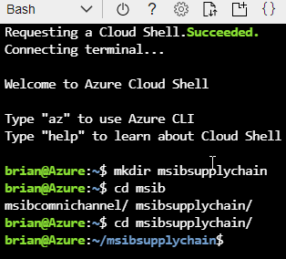

1.  Using the Azure Cloud Shell, you can download the file by executing the following command inside the Cloud Shell window (all on one line):

    ```bash
    curl -o azuredeploy.json curl -o azuredeploy.json https://raw.githubusercontent.com/opsgilitybrian/PartsUnlimited5/main/azuredeploy.json
    ```  

    Then run 

    ```bash  
    ls
    ```  
    
    Ensure that you see a file `azuredeploy.json`.

    

3.  When completed, you will have a new ARM template to deploy the app service plan, the app service, a SQL server and a database to simulate the following:  

    *   Web [The company's public-facing website]

   
4.  If you wish, you can review the ARM template.  

    What you will find is that with the template you will deploy the following resources per environment

    *   An App Service Plan for .Net in the F1 [Free] tier
    *   An App Service that is built and deployed based on code in a GitHub repository.  You will not modify this code for the challenge.  
    *   An Azure SQL Server 
    *   An Azure SQL Database in the Basic plan [$5/month]

    You will deploy four versions of the environment, so you will have four instances of SQL Server that will be accumulating cost.  The remaining resources should incur no charges.

### Task 3: Deploy the Environments

1. Within CloudShell, toggle from PowerShell to Bash using the selection on the top right of the terminal screen.
   
2. Navigate the prompt to the msibcomnichannel folder if you are not already there.

    ```bash  
    cd msibsupplychain
    ```  
   
3. Using the Azure CLI, create a new resource group  

    Name the resource group appropriately (such as msibc_omnichannel).  Set the location to the region nearest to you. 

    ```bash  
    rgName=msibsupplychain
    location=centralus
    echo $rgName
    echo $location
    ```  

    
    
    Once the group name and location are set to variables, create the group:  

    ```bash
    az group create --name $rgName --location "$location"  
    ```  

    

4. Deploy the template.

    Now that the resource group is completed, deploy the template with the following command:

    ```bash
    az deployment group create --resource-group $rgName --template-file "azuredeploy.json"  
    ```  

    For the first run, select `Web`.   

    You will be prompted to enter credentials for the SQL Server.  

    ```bash  
    msibcchallenger
    ```  

    ```bash
    msibc@chllngr123
    ```  

    


    Once completed, the following resources should appear within your Resource Group within the Azure Portal.
    
    
    
### Task 4: Validate Environments and data

1. Validate deployments

    

You should follow all steps provided *before* starting the Omni-channel optimization industry-based challenge.

### Task 5: Signup for the Dynamics 365 Connected Store preview

1. Visit https://dynamics.microsoft.com/en-us/ai/connected-store/ to request a preview of the Dynamics 365 Connected store

    ```text
        https://dynamics.microsoft.com/en-us/ai/connected-store/
    ```
2. Click on the **Request a preview** button

    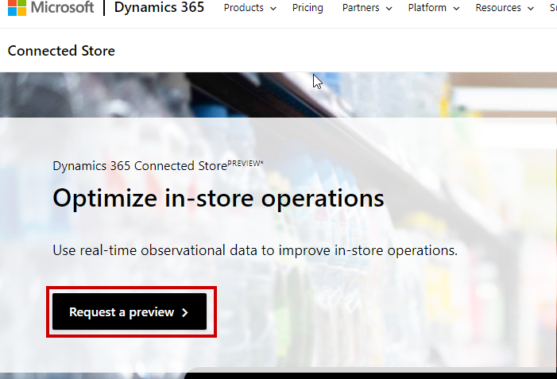
    
3. Enter your email to setup the account and click **Next**

    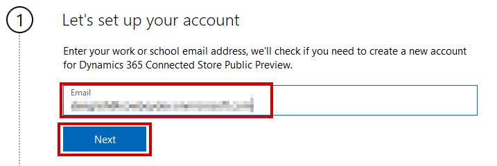
    
4. Click the **Set up account** button

    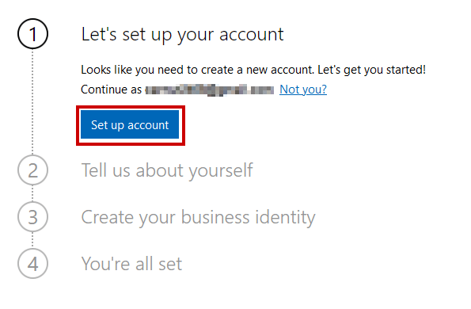
    
5. Enter in some basic business information and click **Next**

    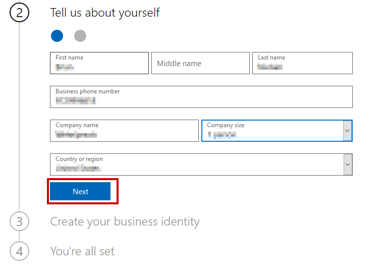
    
6. Enter a phone number to get a verification code. Then click **Send verification code**

    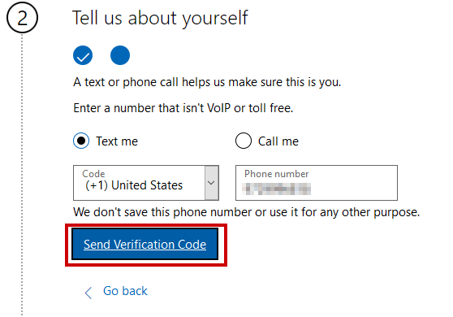
    
7. Enter the code and click the **Verify** button

    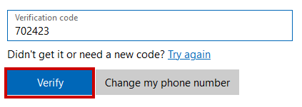

8. Enter a unique subdomain and click the **Check Availability** button until you get one that is validated

    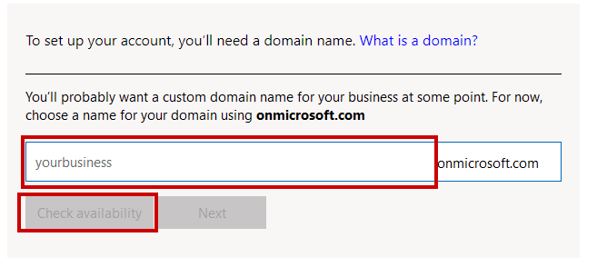
    
9. Once you have a valid subdomain click **Next**

    
    
10. Create a userid and password to login to the store then click **Next**

    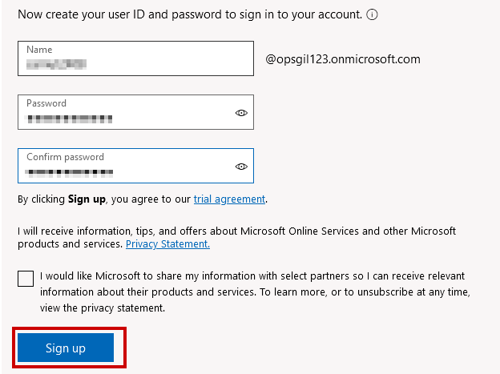
    
### Task 6: Install and setup the app   

1. Visit https://go.microsoft.com/fwlink/?linkid=2143957 to install the Connected Store
    ```text
    https://go.microsoft.com/fwlink/?linkid=2143957
    ```

2. Choose then Environmnet selected and click **Install**

    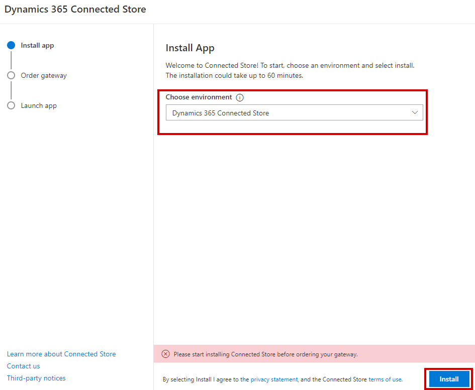
    
3. Click **Next** if prompted

    
    
4. Skip the business data required for the form and click **Next**

    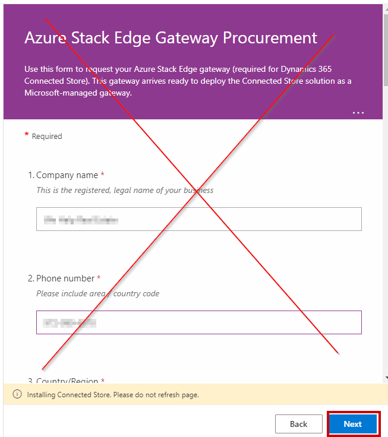
    
5. Watch the video and then click **Launch App**

6. Click on the **Go to sample store** button

    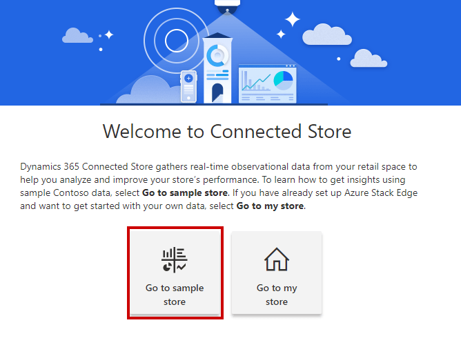
    
7. Make sure you choose **Contoso Sample Store** from the dropdown

    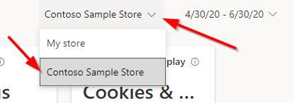
    
8. Sample store Analytics

    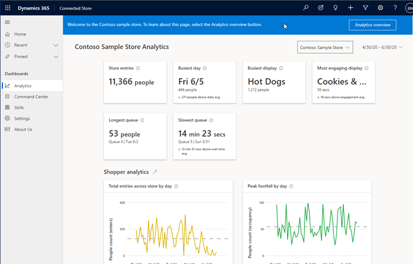
    
    
### Task 7: Setup trial of Salesforce

1. Visit https://www.salesforce.com/form/signup/freetrial-elf-v2/?d=70130000000EqoP to create a free trial

    ```text
    https://www.salesforce.com/form/signup/freetrial-elf-v2/?d=70130000000EqoP
    ```
    
2. Enter the basic information and click **NEXT**

    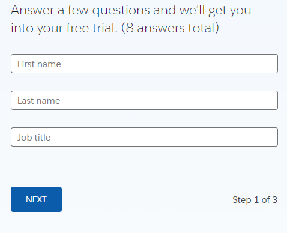

3. Fill in step 2 of the process and click **NEXT**

    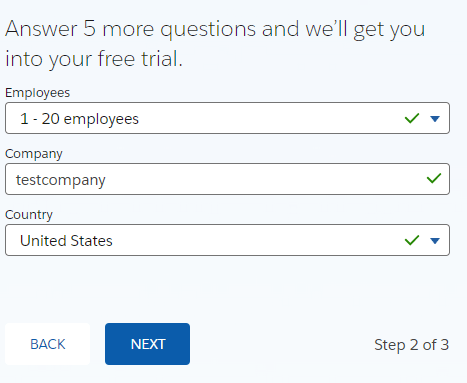
    
4. Enter the final questions and click **SUBMIT**

    
    
5. Login to Salesforce using https://login.salesforce.com/

    ```text
    https://login.salesforce.com/
    ```

6. Login

    
    
7. Verify your login 

    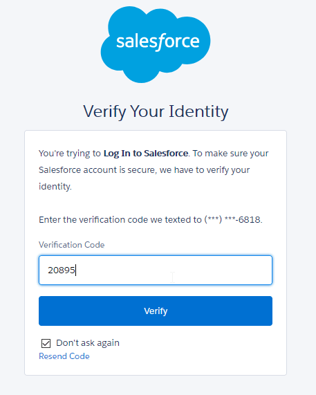
    
You should follow all steps provided *before* starting the Supply chain optimization industry-based hands on lab.