<!-- 

-->

# Industry-Based Challenges: Supply Chain Optimization  

## Hands-on lab guide  

### March 2021  

Information in this document, including URL and other Internet Web site references, is subject to change without notice. Unless otherwise noted, the example companies, organizations, products, domain names, e-mail addresses, logos, people, places, and events depicted herein are fictitious, and no association with any real company, organization, product, domain name, e-mail address, logo, person, place or event is intended or should be inferred. Complying with all applicable copyright laws is the responsibility of the user. Without limiting the rights under copyright, no part of this document may be reproduced, stored in or introduced into a retrieval system, or transmitted in any form or by any means (electronic, mechanical, photocopying, recording, or otherwise), or for any purpose, without the express written permission of Microsoft Corporation.

Microsoft may have patents, patent applications, trademarks, copyrights, or other intellectual property rights covering subject matter in this document. Except as expressly provided in any written license agreement from Microsoft, the furnishing of this document does not give you any license to these patents, trademarks, copyrights, or other intellectual property.

The names of manufacturers, products, or URLs are provided for informational purposes only and Microsoft makes no representations and warranties, either expressed, implied, or statutory, regarding these manufacturers or the use of the products with any Microsoft technologies. The inclusion of a manufacturer or product does not imply endorsement of Microsoft of the manufacturer or product. Links may be provided to third party sites. Such sites are not under the control of Microsoft and Microsoft is not responsible for the contents of any linked site or any link contained in a linked site, or any changes or updates to such sites. Microsoft is not responsible for webcasting or any other form of transmission received from any linked site. Microsoft is providing these links to you only as a convenience, and the inclusion of any link does not imply endorsement of Microsoft of the site or the products contained therein.

© 2020 Microsoft Corporation. All rights reserved.

Microsoft and the trademarks listed at <https://www.microsoft.com/legal/intellectualproperty/Trademarks/Usage/General.aspx> are trademarks of the Microsoft group of companies. All other trademarks are property of their respective owners.


# Supply Chain Optimization hands-on lab guide

## Abstract and learning objectives

Parts Unlimited, a subsidiary of Fabrikam Retail INC., has been feeling some pain and would like your help to redesign and implement some new solutions to be able to better compete in the current marketplace.  Among the main problems that Parts Unlimited is facing are 

*   Lack of connection between online and in-store data leading to an inability to provide a selection optimization that is tailored to a specific customer
*   Lack of infrastructure to maximize cost savings through correct inventory levels
*   Poor last-mile delivery
*   Departments operate in silos so they cannot communicate due to disparate data sources.
*   Limited visibility of data with no feedback loop on the supply chain.
*   Affecting changes to the supply chain is not a trivial endeavor. 
*   No current 360 degree view of the supply chain. 

To remedy this situation, Parts Unlimited is asking you to build a system that takes all of the supply-chain data and ingests it into IoT and Event Hubs as necessary, then performs analysis on the data.

Key success criteria will include 

*   Contract Cycle data and optimization
*   Available to promise capabilities
*   Price-elasticity analysis
*   Route planning and scheduling
*   Demand forecasting

Included in the analysis and processing will be data from 
*   Point of sale transactions
*   Purchase data from all channels
*   Device/Sensor data from IoT devices
*   Warehouse logistical and operational data
*   Social media sentiment and analysis

The primary goal for this system is to conglomerate all of the data into a single source of truth for use in reporting, bringing together all of the moving pieces from the supply chain.  

In the end, your solution should provide a vision that allows the audience (the Chief Marketing Officer, Chief Digital Officer, the Chief Data Officer, and the Customer Experience Manager) to understand how using this solution will give the information that is needed to deliver a 360 degree view of the supply chain.

## Customer case study

### Customer situation

Parts Unlimited Retail, Inc has been selling goods through various retail channels for the past 15 years.  As various platforms and technologies have evolved, Parts Unlimited has struggled to keep up, but has done the best they could to continue to provide solutions for their customers.  

Currently, they have just over 200 brick-and-mortar stores but are planning to close 50+ of these stores next year, taking the number of physical locations down to 150 stores due to declining revenue and various other factors.  Of the remaining 150 stores, 35 of them are currently streamlined for an attempted re-branding that happened a few years ago.  The re-branded stores were chosen based on population bases of less than 50,000 in an 200 square mile radius or within 50 miles of a major metropolitan area. These rebranded "Parts Unlimited Hometown" stores eliminated most of the non-essential retail, such as sporting and workout equipment, and focused in on essentials like appliances, automotive, and kept a limited selection of electronics, only offering about 15% of the options for items like UHD televisions, antennas, and blu-ray players.  Customers have expressed frustrations when an advertisement in the local newspaper for Parts Unlimited included a great deal on a large-screen television only to find they have to order online or drive to the larger store in a city that is sometimes located over 50 miles away.  While it is clear that customers are not pleased with this solution, it is not clear if this is an effective strategy to save the company when it comes to providing a simplified retail option. 

In addition to re-branding efforts, in the past few years attempts have been made to enhance the web app for responsive delivery and a couple of apps were also built to specifically target IOS and Android devices. Unfortunately, the data from these applications and the web solution is not connected, and when a user switches devices or goes from a device to the web, the experience is not uniform, leading to confusion and frustration.  Questions such as "why isn't the item I selected on my phone in my cart when I go to the website?" are far too common.    

Parts Unlimited needs an ability to collect and analyze all of this data in order to make the best uniform solution possible.   The final solution from this challenge workshop should provide an ability for Parts Unlimited to take control of their supply chain so that customers can know when and where products are going to be available, and that stores can be prepared to keep up with expected demands.  

While there are clearly other issues at play that Parts Unlimited needs to solve, the solution you are creating in this workshop needs to allow for a user to be able to walk into a brick-and-mortar store and get the items they are looking for, and for the stores to have the ability to meet demand based on an optimized supply chain. 

This goal of improved ability to meet customer demand will be accomplished by establishing a 360 degree view of the supply chain, with data analysis and reporting that provides the business the ability to plan and schedule deliveries of products according to forecasted needs, based on customer sentiment current buying trends.

#### Customer's current process

Parts Unlimited currently has over 200 brick-and-mortar stores, with 50+ stores closing and 35 stores running the re-branded profile.  Some stores have a pre-determined, limited selection and a limited inventory of the products they do offer. 

Parts Unlimited has an MVC website written in the .Net Framework and has been previously upgraded to version 4.72. The website is supposed to be responsive, as it utilized Bootstrap for responsive layout, but the site is currently not able to work on a few devices due to some styling problems.  

In addition to the website, Parts Unlimited has an Android application written in native Java that is three versions behind the current version of Android, but has been upgraded enough to continue to work on newer devices, even though it does not necessarily leverage all of the features of newer devices.  

Along with the website and android app, a third app written in Swift is available for use on the Apple IOS devices.  

All applications and sites do work, but the user experience, including sign-on, shopping cart, and other factors is unique to each platform.  For example, a user must sign in on the website and then sign in again on the device, and the shopping cart is not shared across devices, so items added to the cart on the web do not show up on the phone, or vice-versa.

As a struggling retailer, Parts Unlimited has a limited amount of resources to apply to getting the entire experience upgraded, so they need you to come up with the best, cost-effective solution.   

When it comes to supply chain management, Parts Unlimited is not very efficient.  They currently have five different departments, all siloed, and none of the departments are working together to get to the overall vision that Parts Unlimited needs.  This is in addition to separate databases used to track products, orders, and customers for the online and the physical store inventory and ordering systems.

The current reporting systems live on top of four different systems with five total silos.  They are as follows:

*   SAP for Demand Planning
*   SAP for Financials
*   Salesforce CRM
*   JD Edwards EDI
*   Oracle Retail ERP

### Current Process  

Current Customer buying solutions:  

 

Current supply chain reporting:  
 

### Customer needs

1.  Use Azure data and analytics tools to create a 360 degree view of the supply chain.

2.  Ingest data from existing systems as defined, as well as other systems and future implementations (i.e. IoT Devices, Website and app telemetry for customer search and purchase data).  Data from point of sale transactions and purchase information should also be ingested.  

3.  Provide reporting to the business user to be able to make decisions around the contract cycle, delivery scheduling and route planning, and demand forecasting with price-elasticity metrics.

4.  Optimize warehouse inventory management and staff utilization to ensure all channels are working with efficiency and no under-staffing or over-staffing according to predicted demands.

5.  An optimized last-mile delivery plan to ensure that customers are getting their orders as quickly as possible.  

6.  An ability to use feedback in any step of the process, as well as give feedback based on findings.  

7.  Because the solution has optimized the supply chain, it will also be possible to optimize the customer return process to expedite returns and getting the products back on the shelves to be sold to other customers.  

### Infographic for common scenarios
 
 

_High-level architecture_

1. Without getting into the details (the following sections will address the particular details), diagram your initial vision for handling the top-level requirements for 

*   Identification of data sources
*   Ingestion of streaming data from sources
*   Organization and/or filtering of data
*   Creating the expected reports
*   Presentation of data to the business users

## Exercise 1: Build the architecture for collecting and ingesting (extract) data

_Data ingest_

1. What are your recommended options for ingesting payment transaction events and customer shopping data as they occur in a scalable way that can be easily processed while maintaining event order with no data loss?

2. Of the ingest options you identified previously, which would you recommend for Parts Unlimited's scenario?

### Success criteria

-	Determine and build the architecture for collecting data into Azure:

    o	On-premises data: customer information, inventory, sales/POS

    o	Online data: customer information, inventory, sales/POS

    o	Workforce optimization data: number of staff each shift, customers per hour

    o	Cost efficiency data: what products are being viewed and purchased most, and by what demographic (location, visitor persona, etc.)

    o	Online traffic and sources to the website (social media, search engines, direct email marketing, mobile app, etc.)

-	Determine and build the architecture for where to ingest data into Azure

_Data ingest solution_

The current solution does get data into a number of databases, but the data is incomplete and not able to be easily used.  The first part of the process will be to get the data ingested - to bring it into a state where it is ready to be used by the rest of the process.  By ingesting the data using Azure Data Factory, you can get the data and transform it if necessary.  In the end, you'll have a complete picture of your data ready to go for the next parts of the process.

In order to begin to work with the data from the various web app databases, you will be required to create a baseline environment with Azure Data Factory for data movement and processing. You will create a Data Factory service, and then install the Data Management Gateway which is the agent that facilitates data movement from multiple databases to Microsoft Azure.

   >**Note**: Complete the Before HOL setup prior to proceeding to the challenge tasks below. Provide this link to participants to access the setup instructions.
   ```bash  
    https://TODO
   ``` 

## Create an Azure Data Lake Storage account and Azure Synapse Analytics service

Before you can connect datasources, you will need to create an Azure Data Lake storage account and the Azure Synapse Analytics service.

### Task 1: Create an Azure Data Lake Storage account

1. Open a web browser and navigate to the Azure portal.

   ```bash  
    https://portal.azure.com
   ``` 

2.  Navigate to the Resource group again and Select **+Add** to create a new resource
   
3.  Search and Select **Storage account** to create a storage account

4.  Complete the following information:
       - Subscription: Your Azure subscription
       - Resource group: use existing
       - Region: same as application created in Before HOL (Central US)
       - Name: Create a unique name
       - Performance: Standard
       - Account kind: StorageV2 (general purpose v2)
       - Replication: Locally-redundant storage (LRS)
  
      

5.  Select **Next** twice to get to the **Advanced** tab
6.  On the **Advanced** tab, locate **Data Lake Storage Gen2**, and select **Enabled** for Hierarchical namespace
   
      

6.  Select **Review + create**
7.  Select **Create** to create the storage account

### Task 2: Create an Azure Synapse Analytics service

1.  Search **Azure Synapse Analytics** and select **Create Synapse workspace**

      

2. On the **Create Synapse workspace** blade, complete the following information.
- Subscription: select existing subscription
- Resource group: Same as created in **Before the Challenge**
- Managed resource group: Leave blank and it will be created
- Workspace name: Enter a unique name
- Region: Select the same region from **Before the Challenge**
- Data Lake Storage account: Select the account created in step 3
- File system name: Select **Create new** and enter a name

   

3.  Select **Next: Security**
    
      
      

4.  Replace the **Admin username** with the username **msibcchallenger**. This is the same username provided for the Azure SQL Databases created in the **Before the Challenge** configuration
5.  Use the same password used in the **Before the Challenge** for the SQL Databases
6.  Select **Review + create**
    
          

7.  When validation succeeds, Select **Create**
8.  When deployment is complete, select **Go to resource**
9.  Under **Analytics pools**, select **SQL pools**

          

10. Select **+New**
    
      
          
11. Enter a name for the **Dedicated SQL pool name** and change the **Performance level** to **DW100c**
12. Select **Review + create**

      
      

### Task 3: Create Azure Data Factory

1. Navigate to the Resource group created in the Before HOL setup instructions.
   
2. Select **+Add** to create a new resource

   

3. Search for **Data Factory** and select **Create**

   

4. Complete the following information:
   - Subscription: Your Azure subscription
   - Resource group: use existing
   - Region: same as application created in Before HOL (Central US)
   - Name: Create a unique name

   

5. On the Git configuration tab, select the box for **Configure Git later**

6. Select **Review + create** and then **Create** to create the Data Factory

7. Select **Go to resource** when the Data Factory deployment is complete

   

   >**Note**: In order to meet Parts Plus' requirements for presenting data, we will need to analyze the data from the various store websites.  Data Factory will be used to move this data from the SQL databases to an Azure Storage Account that can then be accessed by Azure Databricks or Azure Synapse Analytics.

8.  Navigate back to the Resource group and select the **Data factory** service that you created.
   
9.  Select **Author & Monitor** on the overview blade

      


## Exercise 2: Build the architecture for loading and transforming data

_Data transformation_

1. What solutions offer options for ETL and/or ELT?  

2. Which option would you recommend and why?

_Data processing_

1. How will you filter the data to get relevant information?

2. How will you ensure that data processes are repeatable?

### Success criteria

-	Determine and build the architecture for loading the data

    o	Understand what data is being collected and what form

    o	Is the data collected in a hot or cold path, and how would each be loaded into Azure
    - Does any of this data need to be accessible in near real-time?

    o	Design the speed layer (hot path) architecture for real-time data use
    
    o	Design the batch layer (cold path) architecture for monthly data use

_Data pipeline processing solution_

As part of the ingestion and transformation process, you may find reason to process the data and transform it as you ingest it.  By doing the transformation of the original data, you can position the data store to have information ready to go.

While you may do some original transformation of the data, it is also likely that in order to present the final solution you will need to further transform the data that has been previously ingested.  

Databricks allows you to use SQL queries against your Datalake to get your data ready to present.

## Develop a data factory pipeline for data movement

### Task 1: Connect data sources to copy data

1. This takes you to the Azure Data Factory portal
   
2.  Under **Let's get started**, select the **Copy data** image

      

3.  In the Properties page, specify **CopyFromSalesforceToSynapse** for the Task name field, and select Next. 
4.  In the task description, enter **Moving data from store website SQL databases to Azure Synapse Analytics for analysis**
5.  Select **Next**

      

6.  In Source data store, select **+ Create new connection**

      

7.  When the New linked service blade opens, search for **sales** and select **Salesforce**

      

8.  Enter the credentials to connect to Salesforce. Your **New linked service** configuration should look similar to the screenshot below.

      

9.  Select **Create**

10. Following the same steps create another connection for **Common Data Service for Apps** and click **Continue**

    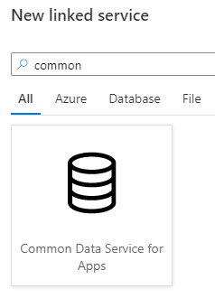
    
11. Copy in the **Service Uri** and selection authentication as **Office365** and enter the correct credentials and finally click the **Create** button.

    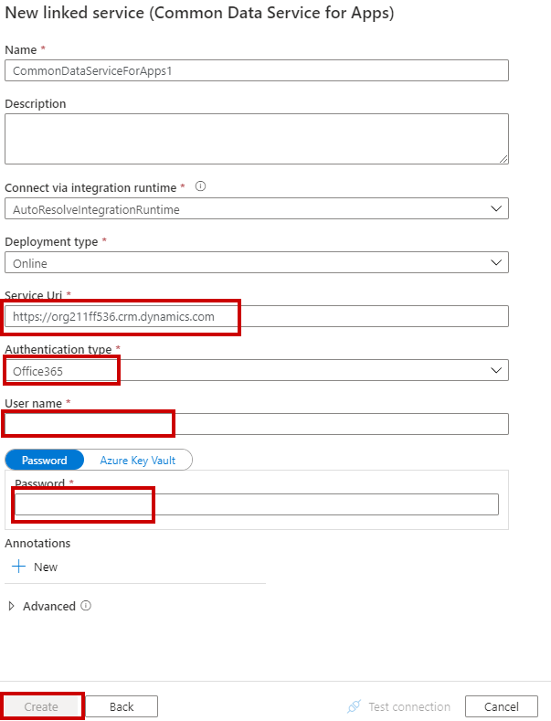
    
11. Select **Next**


12. Under **Dataset** select the following tables
    - Observational Data

      

13. Select **Next**.  
    
14. On the **Apply filter** blade, select **Next**

### Task 2: Connect data destination to copy data

1. You will now be on the **Destination data store** blade, select **+ Create new connection** 
    
      
      

2. Select **Azure Synapse Analytics** and select **Continue**
    
      
      

3. Select the **Server name** for the Azure Synapse workspace that you create and the **Database name** is the SQL pool created
4. Use **SQL Authentication** and use the Username and password used when creating the Azure Synapse Analytics service
5. **Test connection** to verify that it is successfully connecting
6. Select **Create**
   
      
      

7. Select **Next** when returning to **Destination data store**

      
         
8. Leave the default configuration for **Table mapping** and select **Next**
   
      
         

9. Leave the default **Column mapping** and select **Next**
    
      
      

10. In the **Settings** blade, deselect the checkbox for **Use type default**.  
11. Under **Staging account linked service**, select **+ New**
12. Configure the **New linked service** with the **Azure Data Lake Storage** account that you previously created
13. Test the connection and then select **Create**
    
      
          

14. Select **Next**
    
      
          

15. If you are prompted to **Go back and disable type conversion**, select **Previous** and deselect **Type conversion** on the **Column mapping** blade.

      
          

16. Select **Next** to return to **Settings** and select **Next**
    
      
      

17. The **Summary** blade will open to show the pipeline that has been created. Select **Next**
    
      
          

18. The pipeline will go through validation, once all validation has succeeded, select **Finish**

      
      

19. Choose the **Monitor** icon to view the current status and runs of the pipeline

      
      


## Exercise 3: Build the architecture for presenting the data

_Dashboards and reporting_

1. Parts Unlimited's business analysts would like to have a set of dashboards they can monitor that provide real-time views of customer data. What do you propose using to meet this requirement? Be specific about how this solution will be put in place and which features it supports, and why it will be useful to the business analysts.

2. Parts Unlimited's data analysts, who build and maintain reports, are comfortable working with T-SQL. How can they efficiently access the data for analytical queries, ensuring they have access to the most up-to-date data, without impacting the transactional data store?

### Success criteria

-	Determine and build the architecture for presenting the data

    o	Provide a dashboard for business users to be able to review data and make informed decisions

    o	Dashboard should include:
    
    - Sales data for stores and online with a comparison
    - Navigation habits for online customers
    - Purchase and view habits of in person customers
    - Digital marketing and social media effectiveness based on campaigns, traffic to the website, and online sales.
    - Recommendations on products that gain the most traffic by location and demographic

    o	Data should be updated within the dashboard in near real-time based on the frequency of data that is collected.

_Dashboards and reporting solution_  

It doesn't matter how good your data ingestion and transformation is if you never present the results to the appropriate audience.  Using dashboards and other reports, you can use the ingested, transformed, and extracted data to present valuable information to the business decision makers.

## Link Power BI workspace to Azure Synapse Analytics workspace

Now that you have the pipeline built to consolidate the web databases for each of the Parts Plus storefronts, the data needs to be presented to management in a manner that will allow them to make informed decisions.  To do this, Power BI will need to be connected to the Synapse Analytics workspace.


### Task 1: Connect the Power BI workspace to Azure Synapse Analytics workspace


1. From the **Resource group**, navigate to the Azure Synapse workspace
   
      


2. Select **SQL pools** under **Analytics pools** on the menu

      

3. Select the **msibcsqlpool** created in challenge 1

      


4. Launch Synapse Studio

      


5. In **Synapse Studio**, select the **Manage** icon on the left menu

     


### Task 2: Connect to Power BI Desktop through Synapse Analytics Studio

1. On the menu, select **Linked services** under **External connections**

linkedservices

2. Select **+ New** to add a linked service

newlinkedservice2

3. If the yellow **Connect to Power BI** appears across the top of the blade, select that.  If it does not, search for **Power BI**, select the **Power BI** tile and select **Continue**.

connectpowerbi

4. The default **Tenant** and **Workspace** that was created previously should appear in the dropdowns
5. Select **Create**


   

6. Select **Connect**.
7. Select **Publish all** when it appears above **Linked services**
   
      

8. Publish the Power BI workspace

      

### Task 3: Download Power BI

1. Download Power BI Desktop from <https://powerbi.microsoft.com/en-us/desktop/>.

2. When Power BI Desktop starts, you will need to enter your personal information, or Sign in if you already have an account.

   

3. Select Get data on the screen that is displayed next.

   
   
### Task 4: Create Power BI report

1. Click on the Get data link

      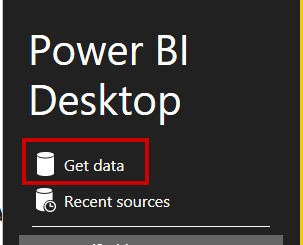
      
2. Search for **Sales** and select **Salesforce Objects** then click **Connect**.

    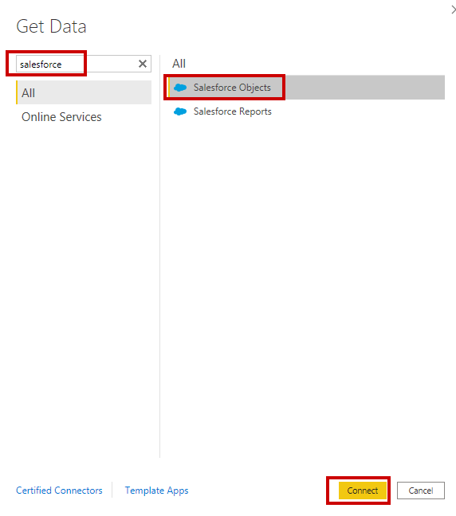
    
3. Leave the defaults and click **OK**

    
    
4. After authenticating, search for **lead** and select **Lead** and click the **Load** button

    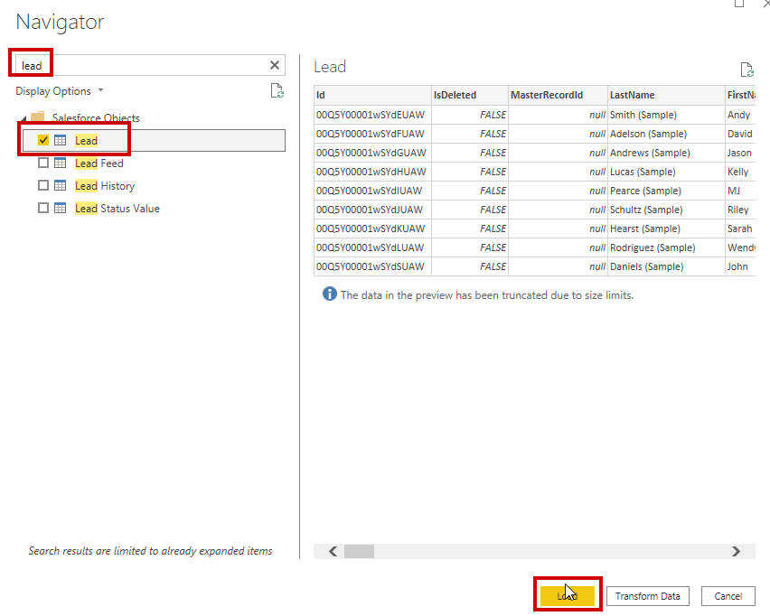
    
5. Click on the **Get data** button

    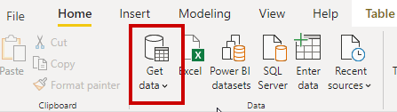
    
6. Search for **Dataverse** and select **Dataverse** and finally click **Connect**

    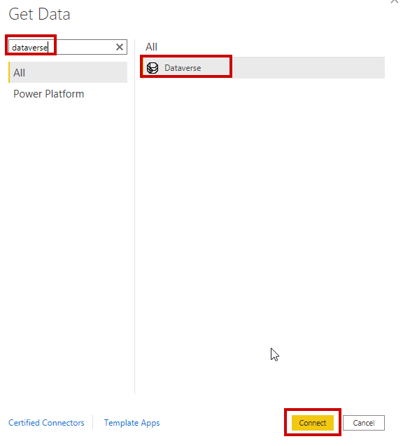
    
7. Copy and paste the domain to the **Connected Store** and paste in the **Environment domain**. Finally, click **OK**

    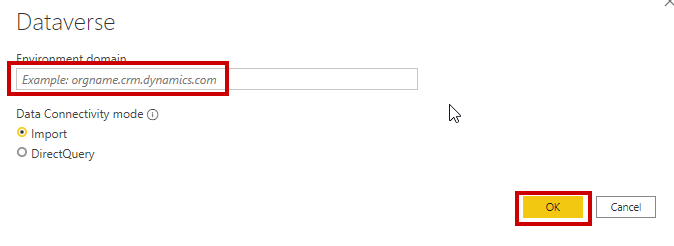
    
8. Start searching for **observe** and select **msdyn_observationaldata** and then click **Load**
      
      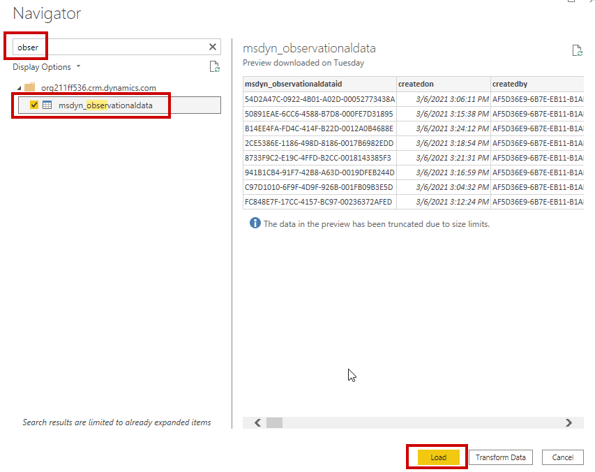
      
9. Add a stacked column chart

    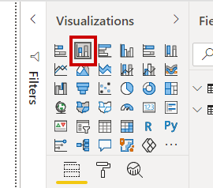
    
10. To get the amount of time individuals spend in different sections of the store setup the following. For the Axis choose **msdyn_zonename** and for Values choose **msdyn_measurementvalue**

    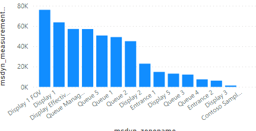
    
11. To find our the busiest days of the weekd setup up the following in another stacked column chart. For the Axis choose **msdyn_dayofweekname** and for the values choose **msdyn_measurementvalue**

    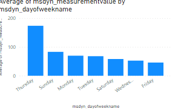

12. In the fields section right click on **msdyn_zonename** and select **New group**

    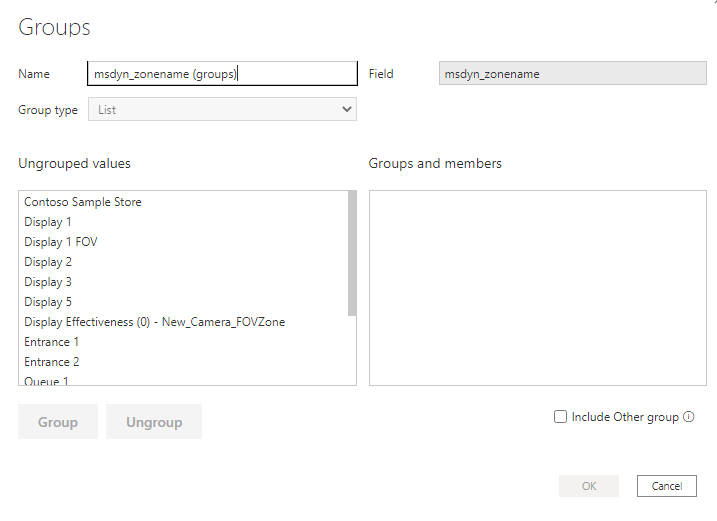
    
13. Select all the **Display** zones and click Group. Then name it to Display

    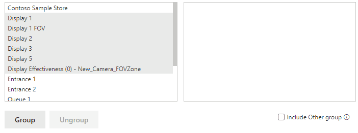
    
14. Repeat the previous step for Queue and Entrance (Note: Put Contoso Sample Store in Entrance)

15. To see how long individuals spend in zone groups add a stacked bar chart. Then for the Axis select the newly created group and for Values select **msdyn_measurementtypename** 

    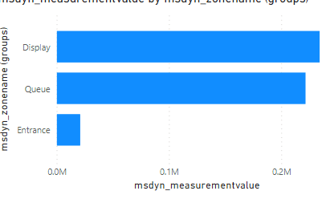

16. Lets find out the Leads by sources. Add a Donut chart and set the Legend to **Leadsource** and the Values to **Company**

    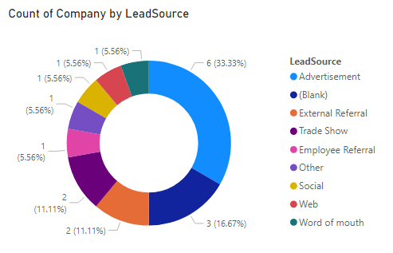

17. Final results in PowerBI

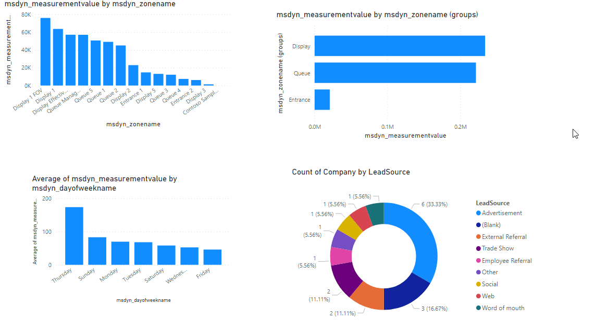    


## Additional references

| **Description**                                        | **Links**                                                                                                                         |
| ------------------------------------------------------ | --------------------------------------------------------------------------------------------------------------------------------- |
| Create a data factory                              | <https://docs.microsoft.com/en-us/azure/data-factory/quickstart-create-data-factory-portal>                                                                         |
| Load data into Azure Data Lake Storage from Azure Data Factory               | <https://docs.microsoft.com/en-us/azure/data-factory/load-azure-data-lake-storage-gen2>                                                                         |
| Azure Data Explorer data ingestion overview        | <https://docs.microsoft.com/en-us/azure/data-explorer/ingest-data-overview>                                                                         |
| What is Azure Databricks        | <https://docs.microsoft.com/en-us/azure/databricks/scenarios/what-is-azure-databricks>                                                                         |
| Azure Synapse Analytics        | <https://azure.microsoft.com/en-us/services/synapse-analytics/>                                                                         |
| Using Synapse analytics from Databricks        | <https://docs.microsoft.com/en-us/azure/databricks/data/data-sources/azure/synapse-analytics>                                                                         |
| Using SQL file metadata in synapse analytics        | <https://docs.microsoft.com/en-us/azure/synapse-analytics/sql/query-specific-files>                                                                         |
| Cosmos Db        | <https://azure.microsoft.com/en-us/services/cosmos-db/>                                                                         |
| Azure Machine Learning       | <https://azure.microsoft.com/en-us/free/machine-learning>                                                                        | 
 IoT Hubs                             | <https://docs.microsoft.com/en-us/azure/iot-hub/about-iot-hub#:~:text=IoT%20Hub%20is%20a%20managed%20service,%20hosted%20in,of%20IoT%20devices%20and%20a%20cloud-hosted%20solution%20backend.>                                                                             |
| Azure IoT Edge                             | <https://azure.microsoft.com/en-us/services/iot-edge/>                                                                             |
| Azure IoT Device Provisioning Service                            | <https://docs.microsoft.com/en-us/azure/iot-dps/about-iot-dps>                                                                             |
| Event Hubs                             | <https://azure.microsoft.com/en-us/services/event-hubs/?OCID=AID2100131_SEM_cad070d74e92111e5f782f066421fc39:G:s&ef_id=cad070d74e92111e5f782f066421fc39:G:s&msclkid=cad070d74e92111e5f782f066421fc39>                                                                         |
| Event Grid              | <https://docs.microsoft.com/en-us/azure/event-grid/overview>                                                                         |


## Additional Resources  

[Microsoft Industry Blog - Retail](https://cloudblogs.microsoft.com/industry-blog/retail/)  

[Optimized Supply Chain](https://www.microsoft.com/en-us/industry/retail/deliver-intelligent-supply-chain?activetab=pivot%3aprimaryr12)  

[Get to know your customer](https://www.microsoft.com/en-us/industry/retail/know-your-customer?activetab=pivot%3aprimaryr11)  

[Personalized Execution](https://www.microsoft.com/en-us/industry/retail/know-your-customer?activetab=pivot:primaryr14)  

[Retail/Consumer Goods Industry](https://www.microsoft.com/en-us/industry/retail-consumer-goods)  

[Intelligent Demand Forcasting](https://www.microsoft.com/en-us/industry/consumer-goods?activetab=pivot:primaryr13)  

[Guide for SQL Database to Data Factory](https://docs.microsoft.com/en-us/azure/data-factory/connector-azure-sql-database)

[Guide to using the copy data tool in Azure Data Factory](https://docs.microsoft.com/en-us/azure/data-factory/tutorial-hybrid-copy-data-tool)

[Guide for SQL Database to Synapse Analytics in Data Factory](https://docs.microsoft.com/en-us/azure/data-factory/load-azure-sql-data-warehouse)

[Guide for Synapse Analytics to Power BI](https://docs.microsoft.com/en-us/azure/synapse-analytics/quickstart-power-bi)